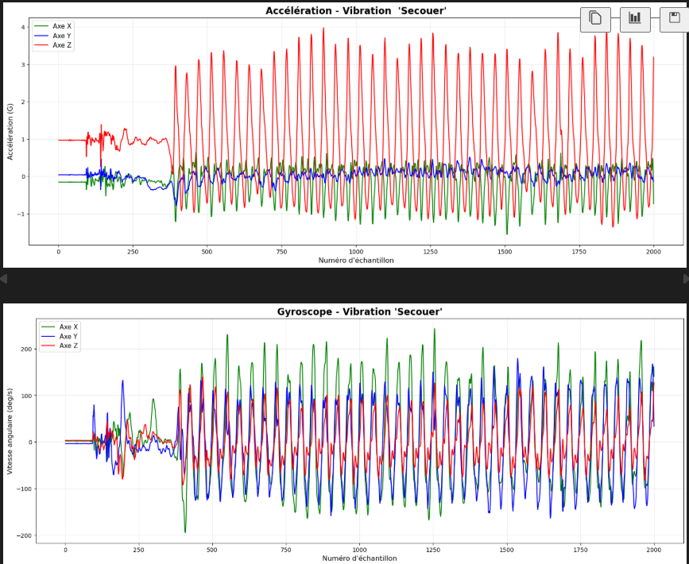
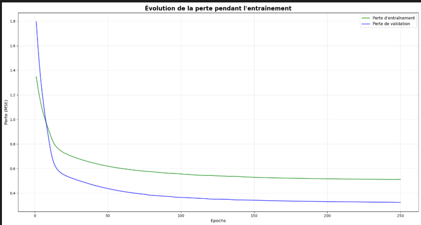
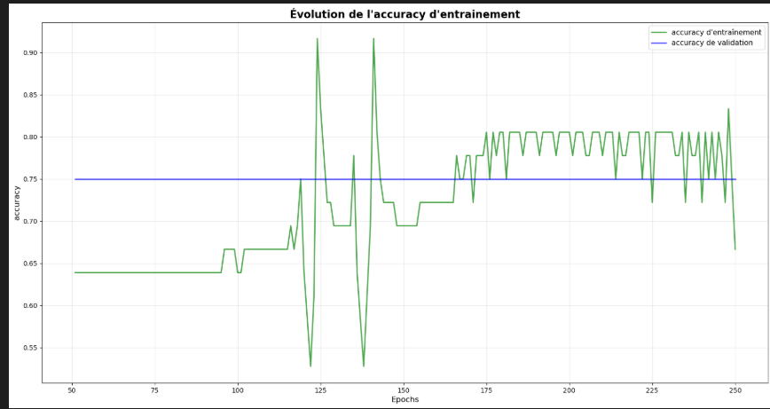
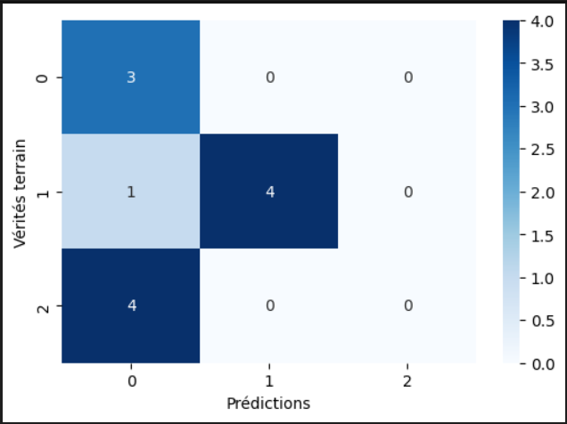
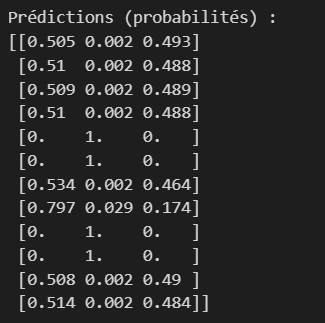
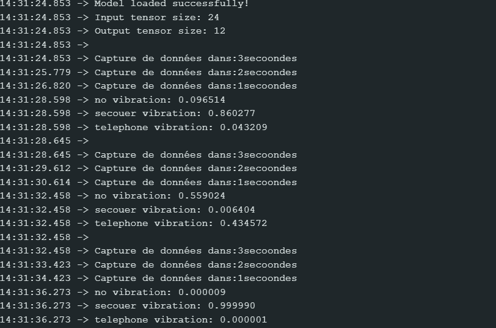

# Documentation - Classification de Vibrations

Table des matières
- [Architecture générale](#architecture-générale)
- [Étape 1 : Collecte de données](#étape-1--collecte-de-données)
- [Étape 2 : Entraînement du modèle](#étape-2--entraînement-du-modèle)
- [Étape 3 : Inférence en temps réel](#étape-3--inférence-en-temps-réel)
- [Contraintes et synchronisation](#contraintes-et-synchronisation)

---

## Architecture générale

### Vue d'ensemble du pipeline

La chaîne de traitement comprend trois étapes principales : la collecte des données brutes depuis les capteurs IMU, l'entraînement du modèle et la conversion au format embarqué, puis enfin l'inférence en temps réel sur la carte Arduino.

### Matériel utilisé

- **Arduino Nano 33 BLE Sense** : capteur IMU intégré (LSM9DS1)
  - Accéléromètre : mesure l'accélération selon 3 axes (aX, aY, aZ)
  - Gyroscope : mesure la vitesse angulaire selon 3 axes (gX, gY, gZ)
  
- **PC/Serveur** : pour l'entraînement du modèle (Python + TensorFlow)

---

## Étape 1 : Collecte de données

### Objectif
Capturer les données brutes des vibrations et les exporter en fichiers CSV pour l'entraînement.

### Configuration Arduino

**Sketch** : `1-DataGeneration_Arduino/data_generation/data_generation.ino`

- Configure l'IMU du Nano 33 BLE Sense
- Lit les données à **50 Hz** (1 lecture toutes les 20 ms)
- Envoie les données au format CSV via la liaison série
- Format des données : `aX,aY,aZ,gX,gY,gZ`

### Collecte via Python

**Script** : `1-DataGeneration_Arduino/serial_data_to_csv.py`

**Utilisation** :

Lancez le script Python en ligne de commande. Vous devez d'abord configurer le port série correctement selon votre système d'exploitation - Windows utilise des ports COM tandis que Linux et macOS utilisent des chemins de périphérique.
**Configuration requise** :

- Modifier la variable `SERIAL_PORT` selon votre système
  - Windows : `COM3`, `COM7`, etc. (vérifiez dans le Gestionnaire de périphériques)
  - Linux/Mac : `/dev/ttyUSB0`, `/dev/ttyACM0`, etc.

**Processus** :

Le script se connecte au port série de l'Arduino et capture les données par chunks automatiquement. Il reconnaît quand une vibration commence et quand elle s'arrête. À la fin, il sauvegarde tous les enregistrements dans un fichier CSV.

### Résumé des 3 classes

| Classe | Description | Intensité |
|--------|-------------|-----------|
| **no_vibration** | Aucun mouvement | Très faible (bruit) |
| **secouer_vibration** | Secouage physique du Nano 33 | Fort |
| **telephone_vibration** | Vibration du téléphone | Faible |

**⚠️ Remarque importante** : La vibration du téléphone est généralement faible et peut ressembler à `no_vibration` selon les features utilisées.

---

## Étape 2 : Entraînement du modèle

### Objectif
Entraîner un modèle de classification, le convertir en TensorFlow Lite, et générer le fichier header Arduino.

### Notebook Jupyter

**Fichier** : `2-Training/notebook/training_vibrations.ipynb`

### Configuration importante

Les paramètres suivants doivent rester constants et identiques dans toutes les étapes du projet. Le nombre de vibrations à classifier est fixé à 3. Le nombre d'échantillons par vibration est 100, ce qui correspond à environ 2 secondes d'enregistrement à 50 Hz. La graine aléatoire est définie pour assurer la reproductibilité des résultats.

### Étapes du notebook

#### 1. Chargement et visualisation des données

Les données CSV sont chargées et affichées graphiquement pour vérifier leur qualité. Les graphiques montrent l'évolution de l'accélération sur les trois axes ainsi que l'évolution de la vitesse angulaire du gyroscope. Cela permet de visualiser les patterns distincts pour chaque type de vibration.



#### 2. Extraction des features

**Transformation** : 100 échantillons × 6 axes → **6 features statistiques**

Pour chaque enregistrement de 100 échantillons, on calcule des features statistiques sur la **magnitude** (norme) de l'accélération et du gyroscope :

**Magnitude** :
- Accélération : $a_{mag} = \sqrt{a_X^2 + a_Y^2 + a_Z^2}$
- Gyroscope : $g_{mag} = \sqrt{g_X^2 + g_Y^2 + g_Z^2}$

**6 Features extraites** (3 pour accélération, 3 pour gyroscope) :

| # | Feature | Formule | Interprétation |
|----|---------|---------|-----------------|
| 1 | **RMS Accélération** | $\sqrt{\frac{1}{N}\sum a_{mag}^2}$ | Intensité moyenne du mouvement |
| 2 | **Variance Accélération** | $\frac{1}{N}\sum a_{mag}^2 - (\overline{a_{mag}})^2$ | Variabilité du mouvement |
| 3 | **Énergie Accélération** | $\sum a_{mag}^2$ | Énergie totale du mouvement |
| 4 | **RMS Gyroscope** | $\sqrt{\frac{1}{N}\sum g_{mag}^2}$ | Intensité moyenne de rotation |
| 5 | **Variance Gyroscope** | $\frac{1}{N}\sum g_{mag}^2 - (\overline{g_{mag}})^2$ | Variabilité de rotation |
| 6 | **Énergie Gyroscope** | $\sum g_{mag}^2$ | Énergie totale de rotation |

**Résultat** : Chaque vibration est représentée par un vecteur de **6 valeurs** qui capture l'essence du mouvement sur les 2 secondes d'enregistrement.

**Exemple** :
```
Input : 100 lectures d'IMU
  [aX, aY, aZ, gX, gY, gZ]
  [aX, aY, aZ, gX, gY, gZ]
  ...
  [aX, aY, aZ, gX, gY, gZ]  (100 lignes)

Output : Vecteur de 6 features
  [RMS_a, Var_a, Ene_a, RMS_g, Var_g, Ene_g]
```

Ces 6 features sont ce qui alimente le modèle de classification.

#### 3. Préparation des données

Les données sont mélangées aléatoirement puis divisées en trois ensembles : 60% pour l'entraînement, 20% pour la validation et 20% pour le test. Après la division, les données sont normalisées en soustrayant la moyenne et en divisant par l'écart-type, calculés sur l'ensemble d'entraînement uniquement. Les paramètres de normalisation sont sauvegardés pour une utilisation ultérieure sur Arduino.

#### 4. Construction et entraînement du modèle

Le modèle est un réseau de neurones avec plusieurs couches denses. Il prend en entrée les 6 features et produit 3 probabilités de sortie, une pour chaque classe. L'optimiseur Adam et la fonction de perte de cross-entropie catégorique sont utilisés. L'entraînement se fait sur plusieurs epochs pour permettre au modèle de converger.





#### 5. Évaluation

Le modèle est testé sur les données qu'il n'a jamais vues pendant l'entraînement. La précision est calculée et affichée. Une matrice de confusion montre comment le modèle confond les différentes classes.



⚠️ **Observation importante** : Les classes 0 (no_vibration) et 2 (telephone_vibration) présentent des probabilités très semblables et sont difficiles à différencier. Cela est dû à la faiblesse de la vibration du téléphone. **Recommandation** : Utilisez un téléphone avec une vibration plus forte lors de la nouvelle collecte de données.



#### 6. Conversion en TensorFlow Lite

Le modèle Keras entraîné est converti au format TensorFlow Lite, un format optimisé pour les appareils embarqués. Le fichier généré est beaucoup plus léger que le modèle original. La taille du fichier est vérifiée pour s'assurer qu'elle ne dépasse pas la limite de mémoire de l'Arduino.

#### 7. Génération du fichier header C++
- Convertit le binaire `.tflite` en tableau hexadécimal
- Génère `model.h` (fichier header C++)
- Intégré directement dans le sketch Arduino

---

## Étape 3 : Inférence en temps réel

### Objectif
Charger le modèle TFLite et classifier les vibrations en temps réel sur Arduino.

### Sketch Arduino

**Fichier** : `3-Inference_Arduino/inference_vibration/inference_vibration.ino`

### Architecture du sketch

#### 1. Initialisation IMU

Le sketch Arduino initialise le capteur IMU pour lire l'accélération et la vitesse angulaire. La fréquence de lecture est fixée à 50 Hz, la même que lors de la collecte des données d'entraînement.

#### 2. Chargement du modèle TFLite

Le fichier header généré par le notebook (contenant le modèle en tant que tableau de bytes) est inclus dans le sketch. Le modèle est chargé en mémoire au démarrage de l'Arduino.

#### 3. Paramètres de normalisation

Les valeurs de moyenne et d'écart-type calculées pendant l'entraînement sont intégrées directement dans le code Arduino sous forme de tableaux de nombres. Ces paramètres doivent être exactement identiques à ceux utilisés lors de l'entraînement du modèle.

#### 4. Capture et classification

Le sketch attend une vibration en surveillance continue. Quand une accélération dépasse un seuil, il capture 100 échantillons consécutifs. Les données capturées sont normalisées à l'aide des paramètres de normalisation, puis le modèle TFLite effectue l'inférence. Le résultat affiche les probabilités prédites pour chaque classe de vibration.

### Flux d'exécution

Le programme lit en continu les données de l'IMU. Lorsqu'une accélération significative est détectée, il capture une fenêtre de 100 échantillons. Après normalisation, le modèle prédit quelle classe de vibration correspond aux données capturées. Les résultats incluent les probabilités de prédiction pour chaque classe.

### Tests et résultats

Les résultats d'inférence sont affichés sur le moniteur série. Vous pouvez voir les probabilités de prédiction pour chaque classe et vérifier que le modèle classifie correctement les vibrations.




---

## Contraintes et synchronisation

### ⚠️ Paramètres critiques qui DOIVENT être identiques

| Paramètre | Étape 1 | Étape 2 | Étape 3 | Valeur |
|-----------|---------|---------|---------|---------|
| Fréquence IMU | Sketch Arduino | - | Sketch Arduino | **50 Hz** |
| Samples par vibration | - | Notebook | Sketch Arduino | **100** |
| Nombre de features | Sketch Arduino | Notebook | Sketch Arduino | **6** (aX, aY, aZ, gX, gY, gZ) |
| Nombre de classes | - | Notebook | Sketch Arduino | **3** |
| Normalisation (mean) | - | Notebook | Sketch Arduino | **Doit être identique** |
| Normalisation (std) | - | Notebook | Sketch Arduino | **Doit être identique** |

### Vérification de synchronisation

- [ ] `SAMPLES_PER_VIBRATION` = 100 partout
- [ ] `SEED` = 1400 pour reproductibilité
- [ ] mean/std du notebook = mean/std du sketch Arduino
- [ ] Ordre des features : aX, aY, aZ, gX, gY, gZ
- [ ] 3 classes : no_vibration, secouer_vibration, telephone_vibration

---

## Troubleshooting

### Problème : Mauvaise classification
**Cause possible** : mean/std désynchronisés entre étapes
**Solution** : Vérifiez les fichiers `mean.npy` et `std.npy`

### Problème : Modèle trop volumineux pour Arduino
**Cause possible** : Modèle non compressé
**Solution** : Appliquez la quantification dans le notebook

### Problème : Téléphone_vibration ≈ No_vibration
**Cause possible** : Vibration téléphone trop faible
**Solution** : Collectez plus de données, augmentez l'intensité du téléphone, ou considérez de nouvelles features

---

## Notes additionnelles

- Les fichiers `.npy` (mean, std) doivent être conservés pour la reproductibilité
- Le modèle TFLite est statique ; toute modification nécessite un réentraînement complet
- La latence d'inférence sur Arduino est < 100 ms

