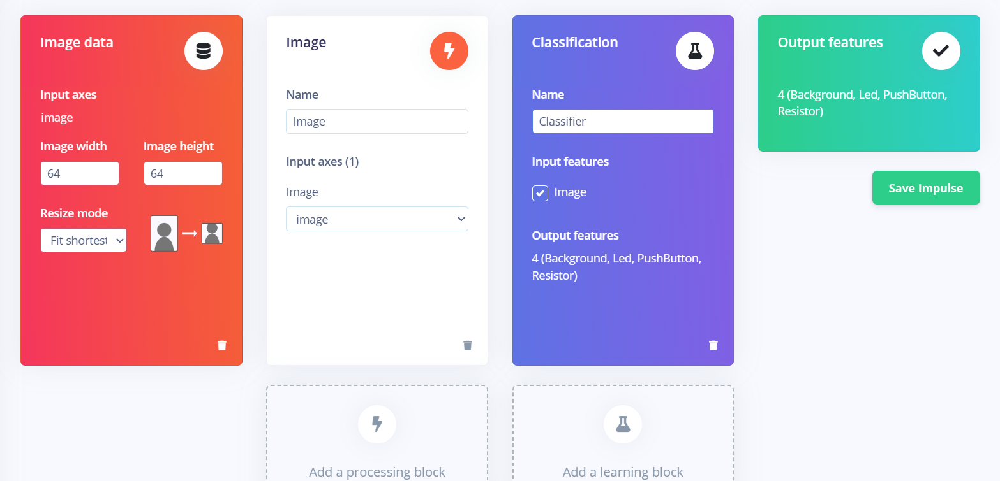
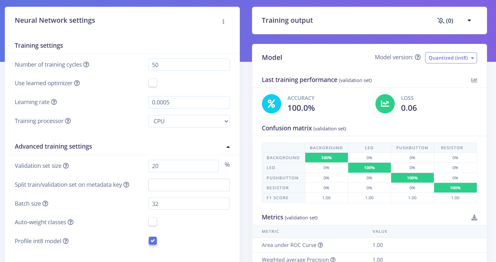
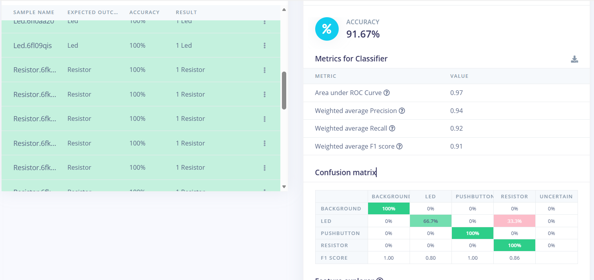
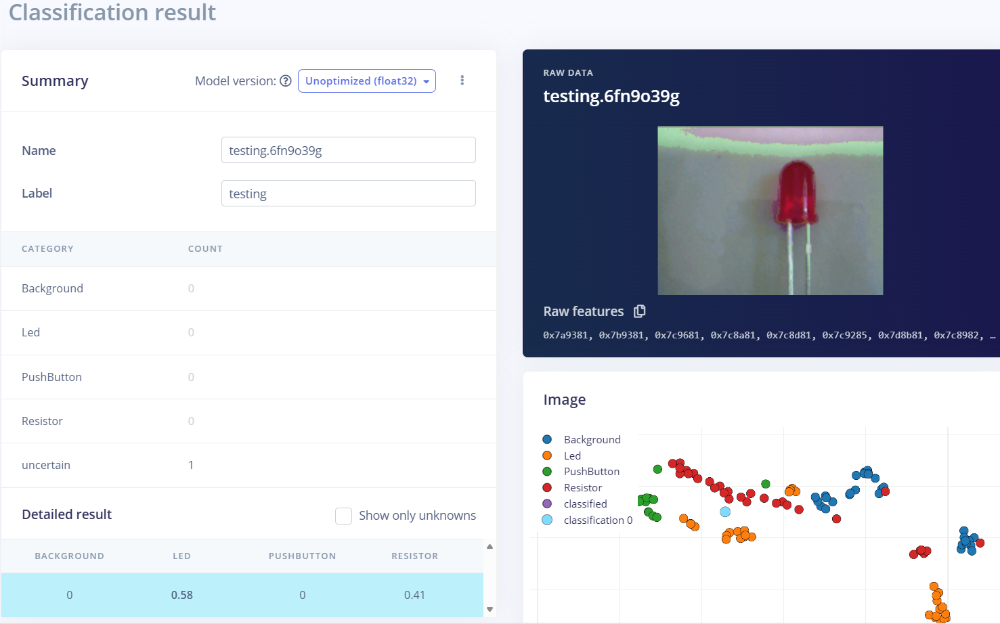
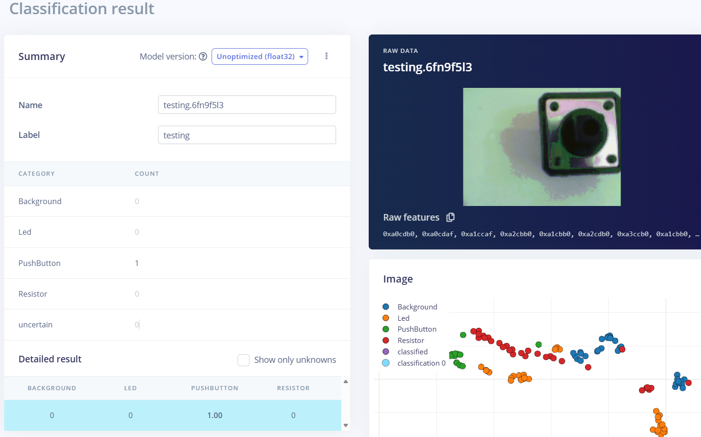

#               Etapes réalisées sur Edge Impulse

## Acquisition de données

Pour constituer la base de données destinée au traitement d'images sur Edge Impulse, j'ai enregistré moi-même les images utilisées pour l'entraînement et le test :
### Composition du dataset

Le dataset final contient quatre classes : **Background**, **Led**, **Resistor** et **Pushbutton**. La répartition des données est la suivante :

- **Pour chaque classe :**
  - 30 images pour l'entraînement
  - 6 images pour le test
  - **Total : 36 images par classe**

**Total du dataset :** 144 images (4 classes × 36 images)

### Justification de l'approche d'acquisition

Les images initiales téléchargées présentaient des résolutions et une netteté différentes de celles fournies par la caméra OV7675 du Nano BLE 33, ce qui aurait créé une discordance entre les données d'entraînement et le contexte réel d'inférence. Pour garantir une performance optimale :

- **Homogénéité des données :** Enregistrer les images directement avec la caméra OV7675 assure que le modèle est entraîné avec des images ayant exactement les mêmes caractéristiques de résolution et de qualité que celles qu'il traitera en inférence.
- **Adaptation au contexte réel :** Les images capturées par la caméra OV7675 reflètent les conditions réelles d'utilisation avec une qualité et une netteté spécifiques à ce capteur.
- **Robustesse du modèle :** Cette approche garantit une meilleure généralisation et une performance fiable lors de l'exécution sur le matériel embarqué.

### Redimensionnement des images à 64×64 pixels

Les images ont été redimensionnées à 64×64 pixels. La justification détaillée de ce choix est présentée dans la documentation.md.
## Architecture Pipeline

Pour la définition de l’architecture du pipeline, j’ai configuré les éléments suivants :

- **Bloc de prétraitement :** j’ai sélectionné le bloc Image, adapté au traitement d’images et permettant le redimensionnement ainsi que la normalisation des données visuelles.

- **Bloc d’apprentissage automatique :** j’ai choisi le bloc Classification, qui convient à la reconnaissance de catégories d’images.

- **Extraction de caractéristiques :** j'ai opté pour une profondeur de couleur en niveau de gris (grayscale). Ce choix est motivé par plusieurs facteurs :
  - **Robustesse du modèle :** Utiliser la grayscale permet d'éviter que le modèle s'appuie sur la couleur du composant pour déterminer sa classe, et l'oblige à se concentrer uniquement sur la forme, la texture et la structure visuelle.
  - **Optimisation pour systèmes embarqués :** Dans le contexte de TinyML sur un système embarqué avec des ressources limitées (comme l'Arduino Nano BLE 33), la grayscale offre des avantages significatifs :
    - **Réduction de la mémoire :** Une image en grayscale utilise un seul canal (8 bits par pixel) contre trois canaux pour une image RGB (24 bits par pixel), réduisant ainsi la taille des données de 75%.
    - **Diminution de la complexité computationnelle :** Moins de données signifie moins de calculs à effectuer lors de l'inférence, ce qui est essentiel pour garantir une exécution rapide et efficace sur du matériel contraints.

### Pipeline - Illustration

*Capture d'écran du pipeline configuré dans Edge Impulse*

## Entraînement du modèle

- **Pour la phase d'entraînement**, j'ai conservé l'ensemble des paramètres par défaut proposés par Edge Impulse. La seule modification apportée concerne le nombre d'epochs (cycles d'entraînement), que j'ai fixé à 50 afin de permettre au modèle d'apprendre de manière plus approfondie tout en évitant un temps d'entraînement excessif.

### Résultats de l'entraînement

*Capture d'écran des performances du modèle lors de l'entraînement*

## Test du modèle

Le modèle a été testé sur l'ensemble des données de test (6 images par classe). Les résultats de la classification sur les données de test sont présentés ci-dessous :

### Résultats du test

*Capture d'écran des résultats du test avec les matrices de confusion et les scores de précision*

**Observations importantes :**
- La classe **Led** présente la plus faible probabilité de prédiction (66%) lors du test, tandis que les autres classes atteignent 100%.
- Malgré cette variation, le modèle fonctionne correctement sur les données de test et en inférence en direct.

## Classification en direct (Live Classification)

Le modèle a été déployé sur l'Arduino Nano BLE 33 pour effectuer une classification en direct des images capturées par la caméra OV7675.

### Résultats de la classification en direct

*Capture d'écran de la classification en direct pour la classe Led*

*Capture d'écran de la classification en direct pour la classe Resistor*

*Capture d'écran de la classification en direct pour la classe Pushbutton*

**Observations :**
- Le modèle fonctionne de manière fluide et fiable sur le matériel embarqué.
- Les prédictions sont obtenues rapidement grâce aux optimisations de taille d'image (64×64) et du format grayscale.
- Les scores de confiance varient en fonction des conditions d'éclairage et de positionnement du composant.

