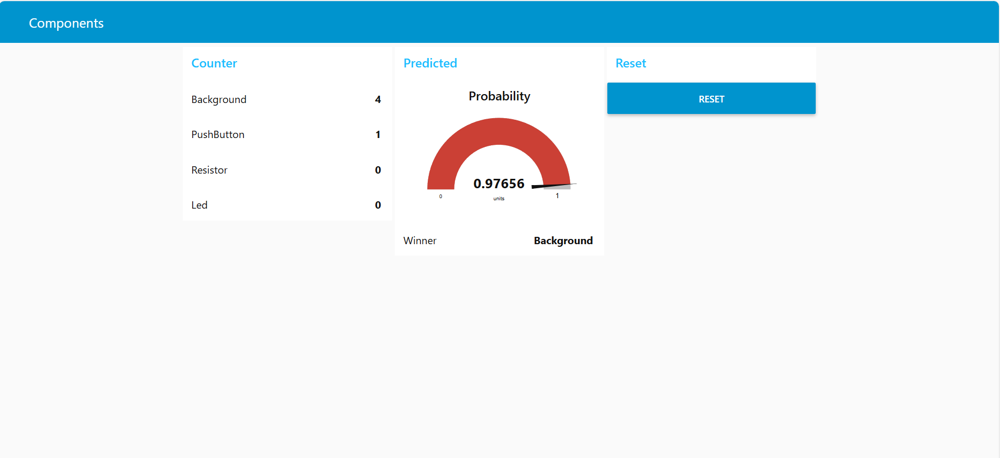

# Dashboard Node-RED – Configuration et Paramétrage



Ce document décrit la configuration du **Dashboard Node-RED** utilisé pour afficher en temps réel :
- les compteurs de détection (Led, Resistor, PushButton, éventuellement Background),
- la classe détectée (“winner”) et sa probabilité (“confidence”),
- des actions utilisateur (ex : remise à zéro).

Le dashboard est alimenté par les données d’inférence Edge Impulse reçues en **Serial** depuis une **Arduino Nano 33 BLE**.

---

## 1. Accès au Dashboard

Une fois Node-RED lancé et le flow déployé :

- Éditeur Node-RED :  
  `http://localhost:1880`
- Dashboard UI :  
  `http://localhost:1880/ui`

> Si la page `/ui` n’existe pas, vérifier que le module `node-red-dashboard` est installé.

---

## 2. Pré-requis Dashboard

### Installation du module dashboard
Dans Node-RED :
1. Menu ☰ → **Manage palette**
2. Onglet **Install**
3. Installer : `node-red-dashboard`
4. Redémarrer Node-RED

---

## 3. Récupération du Flow

Le flow complet est défini dans le fichier **`flows.json`**. Pour l'importer :

1. **Méthode 1 - Import via UI Node-RED :**
   - Accéder à Node-RED : `http://localhost:1880`
   - Menu ☰ → **Import** → **Clipboard**
   - Copier-coller le contenu de `flows.json`
   - Cliquer **Import**

2. **Méthode 2 - Remplacement direct :**
   - Arrêter Node-RED
   - Remplacer le fichier `~/.node-red/flows.json` par notre fichier
   - Redémarrer Node-RED

---

## 4. Structure du Dashboard (Tab / Group)

Le dashboard est organisé en **une Tab** (`Components`) contenant **3 Groups** :

#### Tab : Components

| Group | Contenu | Ordre |
|-------|---------|-------|
| **Counter** | Compteurs pour chaque classe | 1 |
| **Predicted** | Classe détectée + Probabilité | 2 |
| **Reset** | Bouton de réinitialisation | 3 |

### Group 1 : Counter
- **Led** (UI Text) : Affiche le nombre de détections Led
- **Background** (UI Text) : Affiche le nombre de détections Background
- **PushButton** (UI Text) : Affiche le nombre de détections PushButton
- **Resistor** (UI Text) : Affiche le nombre de détections Resistor

### Group 2 : Predicted
- **Winner** (UI Text) : Affiche la classe détectée à l'instant
- **Probability** (UI Gauge) : Affiche la probabilité (0 à 1) avec jauge colorée

### Group 3 : Reset
- **Reset** (UI Button) : Réinitialise tous les compteurs à 0

---


## 5. Création d'un Tab et d'un Group (avancé)

Si vous créez un nouveau dashboard depuis zéro :

Lorsqu'on configure un nœud `ui_*` (ex: `ui_text`, `ui_gauge`) :
1. Dans **Group**, cliquer sur **+**
2. Créer un **Tab** (ex : `Components`)
3. Créer un **Group** (ex : `Counter`)
4. Valider

> Tous les nœuds `ui_*` doivent appartenir à un **Group**, sinon ils ne s'affichent pas.

---

## 6. Widgets utilisés (recommandation)

### 6.1 Affichage des compteurs (ui_text)
Objectif : afficher les compteurs pour chaque classe.

**Important :** les nœuds `ui_text` affichent `msg.payload` par défaut.  
Si `msg.payload` est un objet (ex : `{Led: 10, Resistor: 3, ...}`), il faut d’abord isoler la valeur à afficher.

#### Méthode recommandée
Pour chaque compteur (ex : Led) :


- Nœud `change` :
  - **Set** `msg.payload` **to** `msg.payload.Led` (expression)
- Nœud `ui_text` :
  - **Label** : `Led`
  - **Value format** : `{{msg.payload}}`

Répéter pour :
- `Resistor`
- `PushButton`
- (optionnel) `Background`

---

### 6.2 Affichage du winner (ui_text)
Objectif : afficher la classe détectée la plus probable.


- `ui_text` :
  - Label : `Winner`
  - Value format : `{{msg.payload}}`

---

### 6.3 Affichage de la probabilité (ui_gauge)
Objectif : afficher la confiance associée au winner.


- `ui_gauge` :
  - min : `0`
  - max : `1`
  - label : `Confidence`

> Option : multiplier par 100 si on préfère une jauge en pourcentage.

---

## 7. Paramétrage visuel recommandé

### Layout (affichage)
Pour les `ui_text`, choisir un layout de type :
- `label | value` (recommandé)

### Taille et organisation
- Group “Counter” : largeur standard (ex : 6 ou 12 selon écran)
- Les compteurs peuvent être affichés sur une seule colonne.

---

## 8. Architecture complète du Flow Node-RED

Le fichier `flows.json` contient le flux complet. Voici son architecture :

### Flux de données (Pipeline)

```
Serial (Arduino) 
    ↓
[Serial In] (COM7, 115200 baud)
    ↓
[Switch] - Filtre "EI:" 
    ↓
[Change] - Supprime "EI:" du payload
    ↓
[JSON] - Parse le JSON
    ↓
┌─────────────────────────────────────────┐
│  [Function 1] - Traitement des compteurs │
│  • Lit les compteurs depuis flow.set()   │
│  • Applique le seuil (80%)               │
│  • Incrémente le compteur de la classe   │
│  • Retourne {Led, Background, ...}       │
└─────────────────────────────────────────┘
    ↓
    ├→ [Change] → msg.payload.Led → [UI Text - Led]
    ├→ [Change] → msg.payload.Background → [UI Text - Background]
    ├→ [Change] → msg.payload.PushButton → [UI Text - PushButton]
    ├→ [Change] → msg.payload.Resistor → [UI Text - Resistor]
    ├→ [Change] → msg.payload.winner → [UI Text - Winner]
    └→ [Change] → msg.payload.prob → [UI Gauge - Probability]
```

### Nœuds clés du Flow

| Nœud | Type | Fonction |
|------|------|----------|
| **Serial In** | `serial-port` | Reçoit les données du port COM7 (115200 baud) |
| **Switch (filtre)** | `switch` | Filtre les messages contenant "EI:" |
| **Change 1** | `change` | Supprime le préfixe "EI:" de la donnée |
| **JSON Parser** | `json` | Convertit le texte JSON en objet JavaScript |
| **Function 1** | `function` | Gère les compteurs avec seuil à 80% |
| **Change 2-6** | `change` | Isole chaque propriété pour les widgets |
| **UI Text/Gauge** | `ui_*` | Affiche les données sur le dashboard |
| **UI Button** | `ui_button` | Bouton Reset |
| **Function 2** | `function` | Réinitialise les compteurs à 0 |

### Détails du Function 1 (Traitement des compteurs)

```javascript
const seuil = 0.80; // 80% de confiance minimum
const label = msg.payload.winner;
const prob  = msg.payload.prob;

let counts = flow.get("counts") || {
  Background: 0,
  Led: 0,
  PushButton: 0,
  Resistor: 0
};

// On compte uniquement si la prédiction est assez sûre
if (prob >= seuil && counts[label] !== undefined) {
  counts[label] += 1;
}

flow.set("counts", counts);

// On renvoie les compteurs pour debug/dashboard
msg.payload = {
  ...counts,
  last: label,
  lastProb: prob
};

return msg;
```

**Logique :**
- Récupère le dernier compteur stocké en mémoire (`flow.set()`)
- Vérifie que la probabilité dépasse 80%
- Incrémente le compteur de la classe détectée
- Stocke les nouveaux compteurs pour la prochaine itération
- Retourne l'objet complet pour alimenter les widgets

---

## 9. Bouton Reset des compteurs

### Objectif
Remettre les compteurs à zéro depuis le dashboard.

Flow :

Nœud `ui_button` :
- Label : `Reset`
- Payload : `reset` (texte par défaut, peu importe)

Nœud `function(reset)` :
```js
flow.set("counts", {
  Background: 0,
  Led: 0,
  PushButton: 0,
  Resistor: 0
});
return msg;
```

---

## 10. Résumé du Workflow Complet

1. **Arduino Nano 33 BLE** capture l'image avec OV7675
2. **Edge Impulse** effectue l'inférence et envoie : `EI: {"winner": "Led", "prob": 0.95, ...}`
3. **Serial In** reçoit la donnée sur COM7
4. **Filter** extrait le JSON
5. **Function 1** met à jour les compteurs si prob ≥ 80%
6. **Nœuds Change** isolent chaque valeur
7. **Widgets UI** affichent en temps réel sur `http://localhost:1880/ui`
8. **Bouton Reset** remet les compteurs à 0 via **Function 2**

---

## 11. Dépannage

| Problème | Solution |
|----------|----------|
| Dashboard ne s'affiche pas | Vérifier que `node-red-dashboard` est installé |
| Widgets vides | Vérifier le nom du serial port (COM7 ?) et la vitesse (115200) |
| Compteurs ne s'incrémentent pas | Vérifier que la probabilité > 80% dans le message JSON |
| Port série inaccessible | Redémarrer Node-RED après connexion Arduino |
